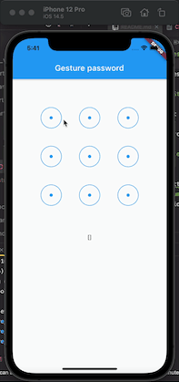

# heavily modified project and should run as an app directly.

I've modified it so I can see the points selected as the touch is moved around. (rather than at the end).

I've also changed it so duplicate entries are allowed.

I also thought that squares would be better but circle allows diagonal movements (otherwise movements near the corners would go to one or other square left/right or top/bottom, not diagonal.


## original readme: (most of it was deleted)

# [flutter_gesture_password](https://github.com/yubo725/flutter-gesture-password)

A flutter gesture password widget.

## Preview



## Install

run this command:

```
flutter pub add flutter_gesture_password
```

This will add a line like this to your package's pubspec.yaml:

```
dependencies:
  flutter_gesture_password: ^0.0.2
```


